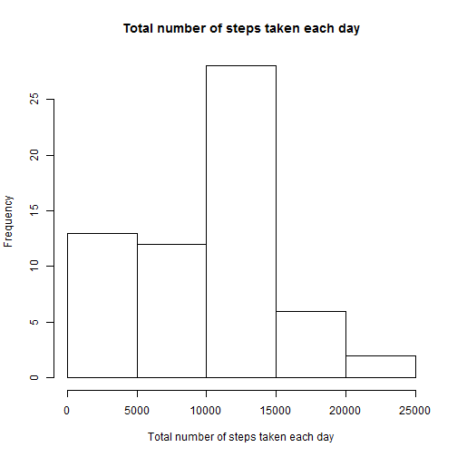
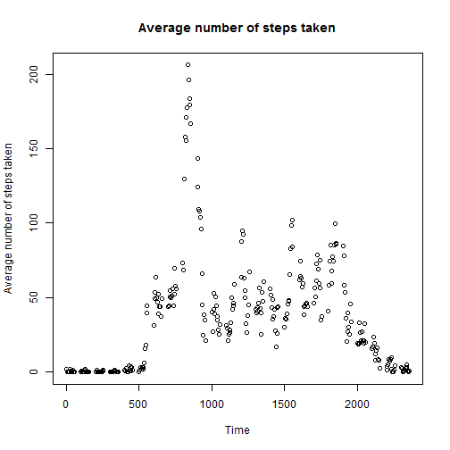
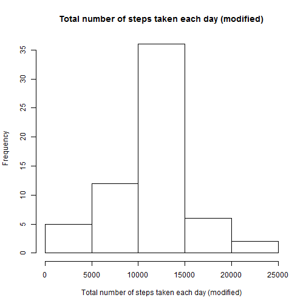

###Loading and preprocessing the data
First, the data is extracted and processed using the code below.


```r
raw<-data.frame(read.csv("activity.csv"))
raw[,2]<-as.Date(raw[,2])
date_level<-unique(raw[,2])
complete<-complete.cases(raw)
filtered<-raw[complete,]
time_level<-unique(raw[,3])
```

###What is mean total number of steps taken per day?
It is then proceed to generate the total number of steps taken each day by using the code below:


```r
count<-rep(0,61)
total<-rep(0,61)
for(i in 1:61){
    relevant<-filtered[,2]==date_level[i]
    hold<-filtered[relevant,1]
  count[i]<-length(hold)
    total[i]<-sum(hold)
}
mean(total)
```

```
## [1] 9354.23
```

```r
median(total)
```

```
## [1] 10395
```

```r
hist(total,main="Total number of steps taken each day",xlab="Total number of steps taken each day")
```

 

From the above, the mean and median are 9354.23 and 10395 respectively.

###What is the average daily activity pattern?
The average daily activity pattern was observed using the code below:


```r
count2<-rep(0,288)
total2<-rep(0,288)
for(i in 1:288){
    relevant2<-filtered[,3]==time_level[i]
    hold<-filtered[relevant2,1]
    count2[i]<-length(hold)
    total2[i]<-sum(hold)
}
average2<-total2/count2
plot(time_level,average2,main="Average number of steps taken",xlab="Time",ylab="Average number of steps taken")
```

 

```r
max(average2)
```

```
## [1] 206.1698
```

```r
time_level[which(average2==max(average2))]
```

```
## [1] 835
```
We observed that the maximum average number of steps taken was 206.1698 at time 0835.

###Imputing missing values
The total number of missing values was calculated using the code below


```r
length(raw[is.na(raw[,1]),1])
```

```
## [1] 2304
```
which is a siginificant 2304.

We choose to ue the overall mean of average number of steps taken to fill the place of the missing value and create a new dataset using the code below:


```r
average<-total/count
true_average<-average[!is.nan(average)]
arbitrary<-mean(true_average)
modified<-raw
modified[is.na(modified),1]<-arbitrary
```
A histogram of the modified total number of steps taken each day was constructed by using the code below:


```r
count3<-rep(0,61)
total3<-rep(0,61)
for(i in 1:61){
    relevant3<-modified[,2]==date_level[i]
    hold<-modified[relevant3,1]
  count3[i]<-length(hold)
    total3[i]<-sum(hold)
}
mean(total3)
```

```
## [1] 10766.19
```

```r
median(total3)
```

```
## [1] 10766.19
```

```r
hist(total3,main="Total number of steps taken each day (modified)",xlab="Total number of steps taken each day (modified)")
```

 

The graphs are different where the first graph has higher weight on the left side, however, when it was modified using the assumption described previously, the weight on the left side was reduced, it look more alike to a normal distribution graph.

Are there differences in activity patterns between weekdays and weekends?

###Are there differences in activity patterns between weekdays and weekends?

The weekdays and weekends were seeked out but confronted error. :(
